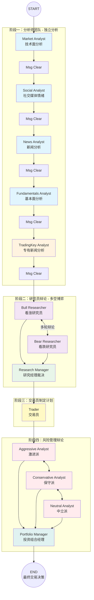

# TradingAgents 框架文档

## 1. 项目概述

TradingAgents 是一个基于多智能体大语言模型（LLM）的金融交易分析框架。通过模拟专业金融团队的协作流程，对指定股票进行多维度分析并生成交易决策建议。

---

## 2. 整体架构

```
┌─────────────────────────────────────────────────────────────────────────────┐
│                              TradingAgents CLI                               │
│  用户交互层：选择股票代码、日期、分析师团队、LLM 提供商、研究深度              │
└──────────────────────────────────────┬──────────────────────────────────────┘
                                       │
┌──────────────────────────────────────▼──────────────────────────────────────┐
│                          TradingAgentsGraph                                  │
│  工作流编排层：LangGraph 有向图，管理所有智能体节点和状态流转                   │
└──────────────────────────────────────┬──────────────────────────────────────┘
                                       │
        ┌──────────────────────────────┼──────────────────────────────┐
        ▼                              ▼                              ▼
┌──────────────┐              ┌──────────────┐              ┌──────────────┐
│  分析师团队   │              │  研究员团队   │              │  风险管理团队  │
│ Analyst Team │              │ Research Team│              │  Risk Team   │
└──────┬───────┘              └──────┬───────┘              └──────┬───────┘
       │                             │                             │
       ▼                             ▼                             ▼
┌──────────────────────┐   ┌──────────────────────┐   ┌──────────────────────┐
│ • Market Analyst     │   │ • Bull Researcher    │   │ • Aggressive Analyst │
│ • Social Analyst     │   │ • Bear Researcher    │   │ • Conservative Anl.  │
│ • News Analyst       │   │ • Research Manager   │   │ • Neutral Analyst    │
│ • Fundamentals Anl.  │   │                      │   │ • Portfolio Manager  │
│ • TradingKey Analyst │   │                      │   │                      │
└──────────────────────┘   └──────────────────────┘   └──────────────────────┘
```

---

## 3. 完整工作流图



---

## 4. 各阶段详细说明

### 4.1 分析师团队（Analyst Team）

每个分析师**独立工作**，不依赖其他分析师的输出。各自调用专属工具获取数据，生成独立报告写入全局状态。

| 分析师 | 职责 | 使用工具 | 输出字段 |
|--------|------|----------|----------|
| **Market Analyst** | 技术面分析（价格趋势、MACD、RSI、布林带等） | `get_stock_data`, `get_indicators` | `market_report` |
| **Social Analyst** | 社交媒体情绪分析 | `get_news` | `sentiment_report` |
| **News Analyst** | 传统新闻与内幕交易分析 | `get_news`, `get_global_news`, `get_insider_transactions` | `news_report` |
| **Fundamentals Analyst** | 基本面分析（财报、资产负债表、现金流） | `get_fundamentals`, `get_balance_sheet`, `get_cashflow`, `get_income_statement` | `fundamentals_report` |
| **TradingKey Analyst** | 专有新闻分析（宏观经济、地缘政治、行业趋势） | `get_tradingkey_global_news` | `tradingkey_report` |

### 4.2 研究员辩论（Research Team Debate）

- **Bull Researcher**：基于所有分析师报告，构建看涨论据
- **Bear Researcher**：基于所有分析师报告，构建看跌论据
- 两者进行多轮辩论（轮次由 `max_debate_rounds` 控制）
- **Research Manager**：综合辩论结果，生成 `investment_plan`

### 4.3 交易员（Trader）

基于研究报告和辩论结果，制定具体的交易策略和计划。

### 4.4 风险管理辩论（Risk Management Debate）

- **Aggressive Analyst**：激进风险评估
- **Conservative Analyst**：保守风险评估
- **Neutral Analyst**：中立风险评估
- 多轮辩论后由 **Portfolio Manager** 做出最终决策：`BUY` / `SELL` / `HOLD`

---

## 5. 数据流转详解

### 5.1 全局状态（AgentState）

```
AgentState
├── company_of_interest: 股票代码（如 "NVDA"）
├── trade_date: 交易日期（如 "2026-04-03"）
├── messages: LangChain 消息列表
│
├── # 分析师报告（独立写入）
├── market_report: 技术面分析报告
├── sentiment_report: 社交媒体情绪报告
├── news_report: 新闻分析报告
├── fundamentals_report: 基本面分析报告
├── tradingkey_report: TradingKey 专有新闻报告
│
├── # 研究员辩论状态
├── investment_debate_state:
│   ├── bull_history: 看涨方辩论历史
│   ├── bear_history: 看跌方辩论历史
│   ├── judge_decision: 研究经理裁决
│   └── count: 辩论轮次
├── investment_plan: 研究团队投资计划
│
├── # 交易员
├── trader_investment_plan: 交易员计划
│
├── # 风险管理辩论状态
├── risk_debate_state:
│   ├── aggressive_history: 激进派历史
│   ├── conservative_history: 保守派历史
│   ├── neutral_history: 中立派历史
│   └── judge_decision: 投资组合经理决策
│
└── final_trade_decision: 最终交易决策
```

### 5.2 数据流向图

```
外部数据源
    │
    ├── Yahoo Finance ──────────────────────────────────────┐
    ├── Alpha Vantage ──────────────────────────────────────┤
    ├── TradingKey API (172.16.40.22:5000) ─────────────────┤
    │                                                       │
    ▼                                                       ▼
┌───────────────────────────────────────────────────────────────────┐
│ 分析师团队（独立并行分析）                                          │
│                                                                   │
│  Market Analyst ──────→ market_report ──────────────────────────┐ │
│  Social Analyst ──────→ sentiment_report ───────────────────────┤ │
│  News Analyst ────────→ news_report ────────────────────────────┤ │
│  Fundamentals Analyst → fundamentals_report ────────────────────┤ │
│  TradingKey Analyst ──→ tradingkey_report ──────────────────────┤ │
└───────────────────────────────────────────────────────────────────┘
    │
    ▼ 所有报告汇总到全局状态
┌───────────────────────────────────────────────────────────────────┐
│ 研究员辩论                                                        │
│                                                                   │
│  Bull Researcher ← 读取所有 5 份报告 → Bear Researcher            │
│                           ↓                                       │
│                  Research Manager 裁决                             │
│                           ↓                                       │
│                    investment_plan                                │
└───────────────────────────────────────────────────────────────────┘
    │
    ▼
┌───────────────────────────────────────────────────────────────────┐
│ 交易员                                                            │
│                                                                   │
│  Trader → trader_investment_plan                                  │
└───────────────────────────────────────────────────────────────────┘
    │
    ▼
┌───────────────────────────────────────────────────────────────────┐
│ 风险管理辩论                                                      │
│                                                                   │
│  Aggressive ←→ Conservative ←→ Neutral                            │
│                           ↓                                       │
│              Portfolio Manager 最终决策                            │
│                           ↓                                       │
│              BUY / SELL / HOLD                                    │
└───────────────────────────────────────────────────────────────────┘
```

---

## 6. 数据供应商路由系统

### 6.1 架构

```
分析师调用工具
       │
       ▼
┌──────────────────┐
│  route_to_vendor │ ← 路由中心
│  (interface.py)  │
└────────┬─────────┘
         │
    读取配置
         │
         ▼
┌─────────────────────────────────────────────────┐
│              VENDOR_METHODS 注册表               │
│                                                 │
│  get_news:                                      │
│    ├── yfinance → get_news_yfinance()           │
│    ├── alpha_vantage → get_alpha_vantage_news() │
│    └── local_api → get_news_local_api()         │
│                                                 │
│  get_global_news:                               │
│    ├── yfinance → get_global_news_yfinance()    │
│    ├── alpha_vantage → get_alpha_vantage_...()  │
│    └── local_api → get_global_news_local_api()  │
│                                                 │
│  get_stock_data:                                │
│    ├── yfinance → get_YFin_data_online()        │
│    └── alpha_vantage → get_alpha_vantage_stock()│
└─────────────────────────────────────────────────┘
         │
         ▼
    执行具体函数
         │
         ▼
    返回格式化字符串
```

### 6.2 配置示例

```python
config = {
    "data_vendors": {
        "core_stock_apis": "yfinance",      # 股票价格数据源
        "technical_indicators": "yfinance", # 技术指标数据源
        "fundamental_data": "yfinance",     # 基本面数据源
        "news_data": "local_api",           # 新闻数据源（使用你的本地 API）
    }
}
```

---

## 7. LLM 客户端抽象层

### 7.1 支持的提供商

| 提供商 | 配置 Key | 基础 URL | 环境变量 |
|--------|----------|----------|----------|
| OpenAI | `openai` | `https://api.openai.com/v1` | `OPENAI_API_KEY` |
| Google | `google` | `https://generativelanguage.googleapis.com/v1` | `GOOGLE_API_KEY` |
| Anthropic | `anthropic` | `https://api.anthropic.com/` | `ANTHROPIC_API_KEY` |
| xAI | `xai` | `https://api.x.ai/v1` | `XAI_API_KEY` |
| OpenRouter | `openrouter` | `https://openrouter.ai/api/v1` | `OPENROUTER_API_KEY` |
| **阿里云百炼** | `aliyun` | `https://coding.dashscope.aliyuncs.com/v1` | `ALIYUN_API_KEY` |
| Ollama | `ollama` | `http://localhost:11434/v1` | 无 |

### 7.2 阿里云百炼支持的模型

| 模型 | 显示名称 | 用途 |
|------|----------|------|
| `qwen3.5-plus` | Qwen3.5 Plus | 快速、经济高效 |
| `kimi-k2.5` | Kimi K2.5 | Moonshot AI 模型 |
| `glm-5` | GLM-5 | 智谱 AI 模型 |
| `MiniMax-M2.5` | MiniMax M2.5 | 高性能 |

---

## 8. TradingKey 集成详解

### 8.1 本地 API

```
GET http://172.16.40.22:5000/news

参数:
  - start_date: 起始日期 YYYY-MM-DD（默认 3 天前）
  - end_date: 结束日期 YYYY-MM-DD（默认今天）
  - category: 新闻分类（可选，模糊匹配）

响应:
{
  "count": N,
  "start_date": "YYYY-MM-DD",
  "end_date": "YYYY-MM-DD",
  "category": "xxx",
  "news": [
    {
      "title": "新闻标题",
      "content": "新闻内容",
      "category": "分类",
      "exact_time": "2026年4月3日 01:24"
    }
  ]
}
```

### 8.2 集成组件

```
tradingagents/agents/utils/tradingkey_tools.py
    └── get_tradingkey_global_news()  # LangChain 工具

tradingagents/agents/analysts/tradingkey_analyst.py
    └── create_tradingkey_analyst()   # 智能体节点

tradingagents/agents/utils/agent_states.py
    └── tradingkey_report             # 全局状态字段
```

### 8.3 TradingKey Analyst 职责

分析 TradingKey 平台上影响市场价格变化的各类新闻：
- 宏观经济（美联储利率、通胀数据）
- 金融市场动态（股票、比特币、黄金涨跌）
- 公司层面消息（财报、产品发布）
- 地缘政治事件
- 行业趋势和板块轮动

---

## 9. 如何接入新数据源

### 9.1 步骤

1. **创建数据获取文件**：在 `tradingagents/dataflows/` 下创建 `my_provider.py`

2. **实现数据获取函数**：
```python
def get_my_provider_news(ticker, start_date, end_date) -> str:
    """获取新闻数据，返回格式化的 Markdown 字符串"""
    # 从你的数据源获取
    # 返回 Markdown 格式字符串
    return result
```

3. **注册到路由系统**：修改 `tradingagents/dataflows/interface.py`
```python
from .my_provider import get_my_provider_news

VENDOR_METHODS = {
    "get_news": {
        # ... 现有供应商
        "my_provider": get_my_provider_news,
    },
}
```

4. **配置使用**：
```python
config = {
    "data_vendors": {
        "news_data": "my_provider",
    }
}
```

---

## 10. 项目目录结构

```
TradingAgents/
├── cli/                          # 命令行界面
│   ├── main.py                   # CLI 入口和显示逻辑
│   ├── utils.py                  # 交互选择工具
│   └── models.py                 # 数据模型（枚举等）
│
├── tradingagents/
│   ├── agents/                   # 智能体实现
│   │   ├── analysts/             # 分析师团队
│   │   │   ├── market_analyst.py
│   │   │   ├── social_media_analyst.py
│   │   │   ├── news_analyst.py
│   │   │   ├── fundamentals_analyst.py
│   │   │   └── tradingkey_analyst.py  # TradingKey 分析师
│   │   ├── researchers/          # 研究员团队
│   │   │   ├── bull_researcher.py
│   │   │   └── bear_researcher.py
│   │   ├── risk_mgmt/            # 风险管理团队
│   │   │   ├── aggressive_debator.py
│   │   │   ├── conservative_debator.py
│   │   │   └── neutral_debator.py
│   │   ├── managers/             # 管理者
│   │   │   ├── research_manager.py
│   │   │   └── portfolio_manager.py
│   │   ├── trader/               # 交易员
│   │   │   └── trader.py
│   │   └── utils/                # 工具和状态
│   │       ├── agent_states.py   # 全局状态定义
│   │       ├── agent_utils.py    # 通用工具函数
│   │       ├── memory.py         # BM25 记忆系统
│   │       ├── core_stock_tools.py
│   │       ├── technical_indicators_tools.py
│   │       ├── fundamental_data_tools.py
│   │       ├── news_data_tools.py
│   │       └── tradingkey_tools.py  # TradingKey 工具
│   │
│   ├── dataflows/                # 数据供应商层
│   │   ├── interface.py          # 路由中心
│   │   ├── config.py             # 配置管理
│   │   ├── y_finance.py          # Yahoo Finance 实现
│   │   ├── yfinance_news.py      # Yahoo Finance 新闻
│   │   ├── alpha_vantage*.py     # Alpha Vantage 实现
│   │   ├── local_news_api.py     # 本地新闻 API
│   │   └── stockstats_utils.py   # 技术指标计算
│   │
│   ├── graph/                    # LangGraph 工作流
│   │   ├── trading_graph.py      # 主入口类
│   │   ├── setup.py              # 图构建
│   │   ├── conditional_logic.py  # 条件分支
│   │   ├── propagation.py        # 状态传播
│   │   ├── reflection.py         # 反思学习
│   │   └── signal_processing.py  # 信号处理
│   │
│   └── llm_clients/              # LLM 客户端抽象层
│       ├── base_client.py
│       ├── factory.py
│       ├── openai_client.py
│       ├── anthropic_client.py
│       ├── google_client.py
│       ├── model_catalog.py
│       └── validators.py
│
├── main.py                       # 备用入口
├── pyproject.toml                # 项目配置
└── reports/                      # 分析报告输出目录
```

---

## 11. 使用示例

### 11.1 CLI 交互式使用

```bash
cd /workspace/TradingAgents
tradingagents
```

按提示选择：
1. 股票代码（如 NVDA）
2. 分析日期（如 2026-04-03）
3. 分析师团队（可多选）
4. LLM 提供商（如 Aliyun DashScope）
5. 快速思考模型（如 qwen3.5-plus）
6. 深度思考模型（如 MiniMax-M2.5）
7. 研究深度（Shallow/Medium/Deep）

### 11.2 编程式使用

```python
from tradingagents.graph.trading_graph import TradingAgentsGraph
from tradingagents.default_config import DEFAULT_CONFIG

config = DEFAULT_CONFIG.copy()
config["llm_provider"] = "aliyun"
config["quick_think_llm"] = "qwen3.5-plus"
config["deep_think_llm"] = "MiniMax-M2.5"
config["data_vendors"] = {
    "news_data": "local_api",  # 使用 TradingKey 数据
}

graph = TradingAgentsGraph(
    selected_analysts=["market", "news", "tradingkey"],
    config=config,
    debug=False,
)

final_state, signal = graph.propagate("NVDA", "2026-04-03")
print(f"决策: {signal}")
```

---

## 12. 报告输出结构

```
reports/NVDA_20260403_120000/
├── complete_report.md          # 完整汇总报告
├── 1_analysts/                 # 分析师报告
│   ├── market.md
│   ├── sentiment.md
│   ├── news.md
│   ├── fundamentals.md
│   └── tradingkey.md           # TradingKey 分析报告
├── 2_research/                 # 研究团队
│   ├── bull.md
│   ├── bear.md
│   └── manager.md
├── 3_trading/                  # 交易团队
│   └── trader.md
├── 4_risk/                     # 风险管理
│   ├── aggressive.md
│   ├── conservative.md
│   └── neutral.md
└── 5_portfolio/                # 最终决策
    └── decision.md
```
