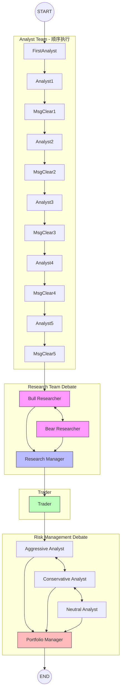

# TradingAgents 工作流与数据流转分析

## 1. 当前工作流图



**执行顺序：**
1. **分析师团队**：按用户选择的顺序依次执行（如 Market → Social → News → Fundamentals → TradingKey）
2. **研究员辩论**：Bull 与 Bear 多轮辩论，Research Manager 裁决
3. **交易员**：基于研究报告制定交易计划
4. **风险管理辩论**：Aggressive、Conservative、Neutral 多轮辩论，Portfolio Manager 裁决

---

## 2. 数据流转验证

### 2.1 状态定义 (`agent_states.py`)
```python
class AgentState(MessagesState):
    # ... 其他字段
    tradingkey_report: Annotated[str, "Report from the TradingKey news analyst"]
```
✅ `tradingkey_report` 已添加到全局状态。

### 2.2 TradingKey Analyst 写入 (`tradingkey_analyst.py`)
```python
return {
    "messages": [result],
    "tradingkey_report": report,
}
```
✅ 正确写入 `tradingkey_report` 字段。

### 2.3 Bull/Bear Researcher 读取 (`bull_researcher.py` / `bear_researcher.py`)
```python
tradingkey_report = state.get("tradingkey_report", "")

prompt = f"""
...
TradingKey proprietary news analysis: {tradingkey_report}
...
"""
```
✅ Bull 和 Bear 研究员都能读取 `tradingkey_report` 并纳入辩论。

### 2.4 工作流连接 (`setup.py`)
```python
if "tradingkey" in selected_analysts:
    analyst_nodes["tradingkey"] = create_tradingkey_analyst(...)
    delete_nodes["tradingkey"] = create_msg_delete()
    tool_nodes["tradingkey"] = self.tool_nodes["tradingkey"]

# 所有分析师统一使用条件边路由
workflow.add_conditional_edges(
    current_analyst,
    getattr(self.conditional_logic, f"should_continue_{analyst_type}"),
    [current_tools, current_clear],
)
workflow.add_edge(current_tools, current_analyst)
```
✅ TradingKey Analyst 现在也走图级工具路由，支持多轮交互分析。

---

## 3. 新增功能

### 3.1 TradingKey Analyst 完全集成

**修改的文件：**

| 文件 | 修改内容 |
|------|----------|
| `cli/models.py` | 添加 `TRADINGKEY = "tradingkey"` 枚举 |
| `cli/utils.py` | 添加到 `ANALYST_ORDER` 选择列表 |
| `cli/main.py` | 添加到 `ANALYST_MAPPING`、`ANALYST_AGENT_NAMES`、`ANALYST_REPORT_MAP`、`all_teams` |
| `graph/conditional_logic.py` | 添加 `should_continue_tradingkey()` 方法 |
| `graph/trading_graph.py` | 添加 `get_tradingkey_global_news` 导入和 `tradingkey` ToolNode |
| `graph/setup.py` | 统一条件边路由逻辑 |

**TradingKey 工具 (`tradingkey_tools.py`)：**
- `get_tradingkey_global_news()` - 从本地 API 获取全球/宏观经济新闻
- API 地址：`http://172.16.40.22:5000/news`
- 支持日期范围过滤和分类过滤

**CLI 选择界面：**
```
» ○ Market Analyst
  ○ Social Media Analyst
  ○ News Analyst
  ○ Fundamentals Analyst
  ○ TradingKey Analyst
```

### 3.2 报告自动保存 final_state.json

**修改文件：** `cli/main.py` 的 `save_report_to_disk()` 函数

**功能：**
- 分析完成后自动保存 `final_state.json` 到报告目录
- 包含所有分析结果、辩论历史、最终决策等完整状态数据
- 为后续复盘功能提供数据源

**报告目录结构：**
```
reports/GLD_20260407_074456/
├── 1_analysts/
│   ├── market.md
│   ├── sentiment.md
│   ├── news.md
│   ├── fundamentals.md
│   └── tradingkey.md          # 新增
├── 2_research/
├── 3_trading/
├── 4_risk/
├── 5_portfolio/
├── complete_report.md
└── final_state.json           # 新增
```

### 3.3 复盘功能（Review Command）

**新增 CLI 命令：**
```bash
python -m cli.main review reports/GLD_20260407_074456 --returns 0.032
# 或简写
python -m cli.main review reports/GLD_20260407_074456 -r 0.032
```

**功能：**
1. 加载 `final_state.json` 中的历史分析数据
2. 传入实际收益率（正数=盈利，负数=亏损）
3. 对 5 个角色进行复盘：
   - Bull Researcher
   - Bear Researcher
   - Trader
   - Research Manager
   - Portfolio Manager
4. 保存复盘结果到 `6_review/` 目录

**复盘输出：**
```
reports/GLD_20260407_074456/
└── 6_review/                  # 新增
    ├── bull_review.md
    ├── bear_review.md
    ├── trader_review.md
    ├── research_manager_review.md
    ├── portfolio_manager_review.md
    └── summary.md             # 汇总报告
```

**复盘内容：**
- 判断决策是否正确
- 归因分析（技术指标、新闻、情绪等）
- 改进建议
- 经验总结

### 3.4 LLM 提供商扩展

**阿里云百炼支持：**
- Provider: `aliyun`
- Base URL: `https://coding.dashscope.aliyuncs.com/v1`
- 环境变量: `ALIYUN_API_KEY`

**支持模型：**
| 模型 | 显示名称 | 用途 |
|------|----------|------|
| `qwen3.5-plus` | Qwen3.5 Plus | 快速、经济高效 |
| `kimi-k2.5` | Kimi K2.5 | Moonshot AI 模型 |
| `glm-5` | GLM-5 | 智谱 AI 模型 |
| `MiniMax-M2.5` | MiniMax M2.5 | 高性能 |

### 3.5 数据供应商扩展

**本地新闻 API 集成：**
- 文件：`tradingagents/dataflows/local_news_api.py`
- API: `http://172.16.40.22:5000/news`
- 支持参数：`start_date`, `end_date`, `category`
- 注册到 `VENDOR_METHODS` 的 `get_news` 和 `get_global_news`

**配置使用：**
```python
config = {
    "data_vendors": {
        "news_data": "local_api",  # 使用本地新闻数据源
    }
}
```

### 3.6 错误处理改进

**yfinance 错误处理：**
- 添加 `try/except` 捕获 `TypeError` 和 `Exception`
- 返回友好的错误信息而非直接崩溃
- 处理空数据和无效响应

**CLI 默认命令：**
- 添加 `invoke_without_command=True` 和 `@app.callback()`
- 直接运行 `python -m cli.main` 即可启动交互式分析

---

## 4. 结论

| 检查项 | 状态 | 说明 |
|--------|------|------|
| 状态字段定义 | ✅ | `tradingkey_report` 已添加 |
| 数据写入 | ✅ | TradingKey Analyst 正确写入 |
| 数据读取 | ✅ | Bull/Bear Researcher 正确读取 |
| 工作流连接 | ✅ | 统一使用图级工具路由 |
| 工具调用处理 | ✅ | 支持多轮交互分析 |
| CLI 选择界面 | ✅ | TradingKey Analyst 可选 |
| CLI 显示界面 | ✅ | 终端正确显示 TradingKey Analyst 状态 |
| 报告保存 | ✅ | 自动保存 final_state.json |
| 复盘功能 | ✅ | review 命令可用 |
| 阿里云支持 | ✅ | 4 个模型可用 |
| 本地新闻 API | ✅ | 集成到路由系统 |

**数据流转正确**，TradingKey 分析结果会传递给后续的研究员辩论环节，且支持完整的复盘流程。
